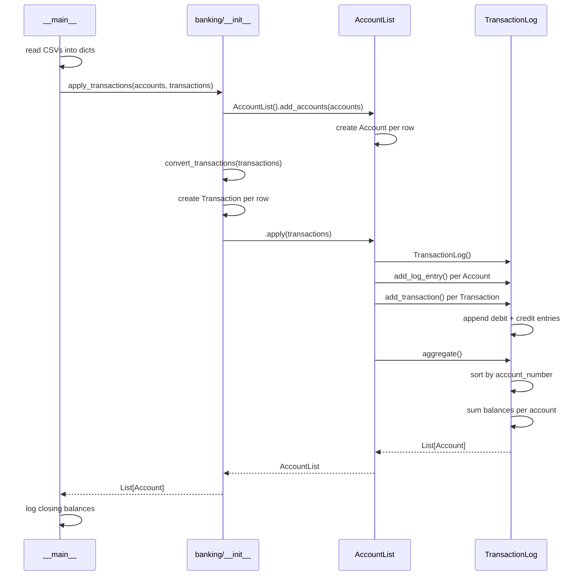

# elbam

Applies a list of transactions to a set of opening account balances and returns the closing balances.

## Install

```bash
pip install flake8 flake8-pyproject pytest pytest-cov
```

## Lint

```bash
flake8 .
```

## Test

```bash
pytest
```

## Run

```bash
python -m banking [balances.csv] [transactions.csv]
```

Defaults to `./mable_account_balances.csv` and `./mable_transactions.csv`.

CSV formats:

```
# balances.csv
account_number,balance

# transactions.csv
from_account_number,to_account_number,amount
```

## How it works


